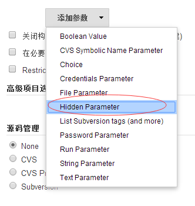

hidden-parameter-plugin
=======================

## Characteristics

		1. Parameters once more, it looks bad user experience.this plugin can resolve the problem.
		2. Some key parameters, once modified, can lead to the risk.these parameters,only administrator can modify,to reduce the risk.
		3. Hidden parameter,only hide in the build execution, in job configuration's page can modify.
		4. After the build, parameter list can display hidden parameters.
		5. Compatible with Pipeline scripts.
	

## How to build this project and generate the .hpi file

> mvn clean package

This command creates the .hpi file in the target directoy.

## How to install this plugin in our Jenkins configured as code

Luckily, we can point to URLs holding hpi files in our configuration as code, so the only thing you need, is to create
a Github release and attach the .hpi file.

Follow these steps:

1. Change the release number in the pom file
2. Compile the project and generate the hpi file
3. Push your changes to master
4. Go to Github and manually create a Github release there, attaching the hpi file to it
5. Edit the Jenkins helm values file and add this plugin as follows in the block **"installPlugins"**:
> - hidden-parameter:0.0.5:https://github.com/fintechinnovationas/hidden-parameter-plugin/releases/download/v0.0.5/hidden-parameter.hpi

This Github project is public, so that Jenkins can easily download the file.

## How to use it in Pipeline scripts

```
parameters {
    hidden(name: 'MY_HIDDEN_FIELD', defaultValue: 'CATS', description: 'My descriptive description')
}
```


##Use case
After the plugin is installed,in job configuration's page,you can see Hidden Parameter:<br>


for example,you add a hidden parameter,is called hidden_para.<br>


click 'Build With Parameters' link ,the parameter hidden_para of the set before, is hide,don't display in this page. <br>


After the build , click 'Parameters' link, parameter list can display hidden parameters hidden_para.<br>


